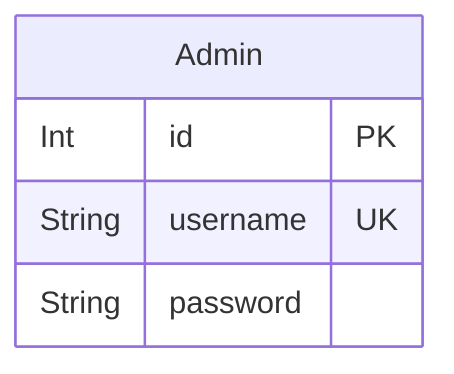
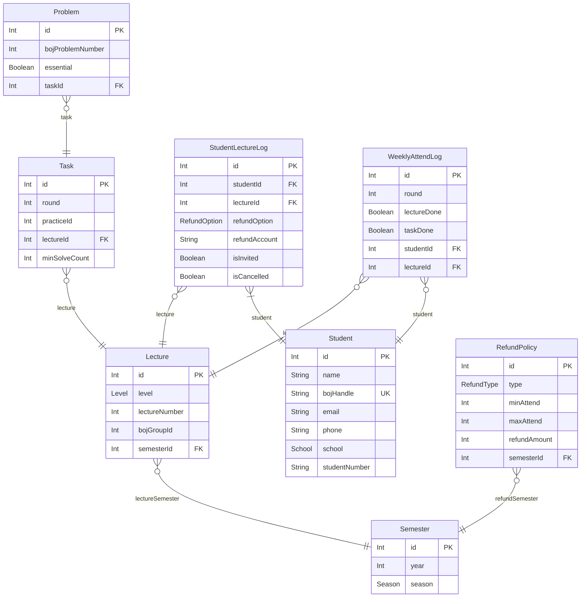

# Sinchon ICPC Camp ERD
> Generated by [`prisma-markdown`](https://github.com/samchon/prisma-markdown)

- [관리자](#관리자)
- [학생관리](#학생관리)

## 관리자

### `Admin`
관리자 계정 정보

**Properties**
  - `id`: Primary Key
  - `username`: 관리자 ID는 중복될 수 없음
  - `password`: 

## 학생관리

### `Student`
학생 정보

학교와 학번을 조합해서 각 학생을 식별

학생은 강의 수강 내역 및 출석 정보를 가짐

**Properties**
  - `id`: Primary Key
  - `name`: 학생의 이름
  - `bojHandle`
    > 학생의 BOJ 핸들
    > 
    > BOJ 핸들은 학생의 문제풀이를 체크할 때 등 학생 관리에 이용
  - `email`: 
  - `phone`: 
  - `school`: 연세대, 서강대, 홍익대, 이화여대, 숙명여대 중 하나
  - `studentNumber`: 학생의 학번

### `Semester`
학기 정보

각 학기는 특정 연도와 계절로 구성

학기는 강의, 환급 정책과 연결됨

환급 정책은 학기마다 하나지만 [RefundPolicy](#RefundPolicy)의 표현 방식상 1:N으로 연결되어 있음. 환급 정책은 출석 범위마다 얼만큼의 비율을 환급해 줄지를 나타내는 여러 개의 범위가 모여서 구성되기 때문

**Properties**
  - `id`: 
  - `year`: 해당 학기가 속한 연도. ex) 2024
  - `season`: 해당 학기가 속한 계절. ex) Summer

### `Lecture`
강의 정보

각 강의는 특정 연도의 특정 학기 소속이고 여러 회차로 구성되어 있음

한 학기에 다양한 난이도(Level)의 강의가 있을 수 있음

**Properties**
  - `id`: 
  - `level`: 강의 난이도. 초급, 중급, 고급 중 하나
  - `lectureNumber`: 강의의 총 회차수. 10회차가 기본값
  - `bojGroupId`: 강의에 연계된 BOJ 그룹 ID. 학생의 과제 출석체크를 위한 크롤링에 쓰임
  - `semesterId`: 

### `Task`
강의의 과제 정보

각 강의마다 여러 개의 과제가 존재할 수 있음

연결된 강의의 BOJ 그룹의 특정 연습 ID를 가지고 있음

각 과제는 여러 개의 문제로 구성

**Properties**
  - `id`: 
  - `round`: 과제가 속한 강의의 회차
  - `practiceId`
    > 해당 강의의 BOJ 그룹 내에서 과제를 나타내는 연습의 ID
    > 
    > BOJ 크롤링 시에 사용
  - `lectureId`: 
  - `minSolveCount`: 과제 출석 여부를 판단하기 위한 기준 문제 수

### `Problem`
강의의 과제에 포함된 문제 정보

각 과제마다 여러 개의 BOJ 문제가 존재할 수 있음

BOJ 문제 번호와 각 문제의 필수 여부를 가지고 있음

과제의 필수 문제를 다 풀었는지로 학생의 출석 체크를 하는 데에 사용됨

**Properties**
  - `id`: 
  - `bojProblemNumber`: 문제의 BOJ 번호
  - `essential`: 해당 문제가 과제의 필수 문제인지 여부
  - `taskId`: 

### `RefundPolicy`
환급 정책 정보

각 학기마다 환급 정책이 존재

강의 출석 환급, 과제 환급이 존재한다

강의출석 혹은 과제를 완료한 회차의 비율에 따라서 환급 비율이 결정됨

당연히 환급 정책이 나타내는 범위 간에는 중첩이 있을 수 없다

예시 : 2024 Summer의 경우

- 과제 환급의 경우 환급조건 만족한 회차가 5회차 미만이면 환급X, 5회차이상 8회차미만 50% 환급, 8회차이상 하면 100% 환급
- 출석은 10회차 중 9회차 이상이어야 1만원 환급, 8회차이하는 0원

**Properties**
  - `id`: 
  - `type`: 환급 유형
  - `minAttend`: 해당 환급조건의 최소 출석 횟수
  - `maxAttend`: 해당 환급조건의 최대 출석 횟수
  - `refundAmount`: 환급되는 금액의 비율
  - `semesterId`: 

### `StudentLectureLog`
각 학생의 수강 신청 내역을 저장한다

[Student](#Student)와 [Lecture](#Lecture)를 연결하는 중간 테이블

[Student.studentLectureLog](#Student) 속성으로 연결

수강신청, 취소 상태와 BOJ 그룹 초대 여부를 저장

**Properties**
  - `id`: 
  - `studentId`: 
  - `lectureId`: 
  - `refundOption`: 학생의 환급 옵션 (환급, 비환급 중 하나)
  - `refundAccount`: 환불 계좌
  - `isInvited`
    > 학생이 BOJ 그룹에 초대되었는지 여부. 초대되었을 시 true
    > 
    > 처음에는 초대되어 있지 않을 것이므로 기본값 false
  - `isCancelled`: 수강신청이 취소되었는지 여부. 취소되었을 시 true

### `WeeklyAttendLog`
학생의 강의 회차별 출석 기록

학생이 강의에 출석했는지, 과제를 했는지 여부를 관리

**Properties**
  - `id`: 
  - `round`: 강의가 몇 번째 회차인지
  - `lectureDone`
    > 학생이 해당 회차의 강의에 출석했는지. 출석했을 시 true
    > 
    > 처음에는 출석하지 않았을 것이므로 기본값 false
  - `taskDone`
    > 학생이 해당 회차의 과제를 했는지. 했을 시 true
    > 
    > 과제는 BOJ 그룹의 연습에 문제를 제출하는 것으로 체크
    > 
    > 처음에는 아직 과제 문제가 풀린 상태가 아닐 것이므로 기본값 false
  - `studentId`: 
  - `lectureId`: 